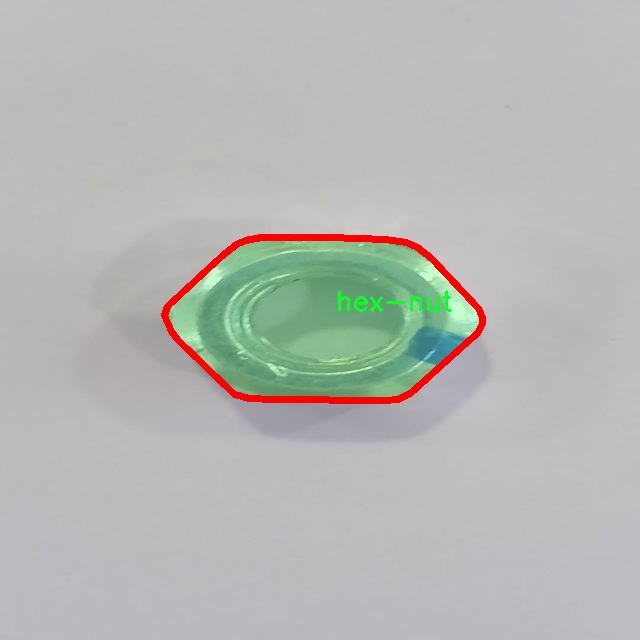

# 六角螺母分割系统： yolov8-seg-EfficientHead

### 1.研究背景与意义

[参考博客](https://gitee.com/YOLOv8_YOLOv11_Segmentation_Studio/projects)

[博客来源](https://kdocs.cn/l/cszuIiCKVNis)

研究背景与意义

随着工业自动化和智能制造的快速发展，精确的零部件识别与分割技术在生产线上的应用变得愈发重要。六角螺母作为机械装配中常见的紧固件，其在装配过程中的定位、识别与分割对提升生产效率和产品质量具有重要意义。传统的图像处理方法在处理复杂背景和多样化螺母形态时，往往难以满足实时性和准确性的要求。因此，基于深度学习的图像分割技术，尤其是实例分割方法，逐渐成为研究的热点。

YOLO（You Only Look Once）系列模型因其高效的实时检测能力和较高的准确性而受到广泛关注。YOLOv8作为该系列的最新版本，在模型结构和训练策略上进行了多项改进，进一步提升了目标检测和分割的性能。然而，针对特定应用场景，如六角螺母的实例分割，现有的YOLOv8模型仍需进行适当的调整和优化，以提高其在特定类别下的表现。

本研究旨在基于改进的YOLOv8模型，构建一个高效的六角螺母分割系统。我们将使用包含1000张图像的专用数据集，专注于单一类别的六角螺母进行训练和测试。该数据集的构建不仅为模型的训练提供了丰富的样本，也为后续的模型评估和性能优化奠定了基础。通过对数据集的深入分析，我们可以更好地理解六角螺母在不同背景、光照和角度下的表现，从而为模型的改进提供有力支持。

本研究的意义在于，通过改进YOLOv8模型，提升六角螺母的实例分割精度，进而推动智能制造领域的应用。具体而言，研究成果将为工业生产线上的自动化装配提供更为精准的视觉识别技术，减少人工干预，提高生产效率。此外，六角螺母作为一种典型的工业零部件，其分割技术的成功应用也将为其他类似零部件的识别与分割提供借鉴，推动整个行业的技术进步。

在实际应用中，改进后的六角螺母分割系统不仅可以应用于传统制造业，还可扩展至智能仓储、机器人抓取等新兴领域。通过实时识别和分割六角螺母，系统能够有效提高自动化设备的工作效率，降低误操作的风险，从而为企业带来显著的经济效益。

综上所述，本研究围绕基于改进YOLOv8的六角螺母分割系统展开，具有重要的理论价值和广泛的应用前景。通过深入探索深度学习在实例分割中的应用，我们希望能够为智能制造领域提供新的解决方案，推动技术的不断创新与发展。

### 2.图片演示


注意：本项目提供完整的训练源码数据集和训练教程,由于此博客编辑较早,暂不提供权重文件（best.pt）,需要按照6.训练教程进行训练后实现上图效果。

### 3.视频演示

[3.1 视频演示](https://www.bilibili.com/video/BV1DFzFYHEPd/)

### 4.数据集信息

##### 4.1 数据集类别数＆类别名

nc: 1
names: ['hex-nut']


##### 4.2 数据集信息简介

数据集信息展示

在本研究中，我们使用了名为“hex”的数据集，以训练和改进YOLOv8-seg模型，专注于六角螺母的分割任务。该数据集的设计旨在提供高质量的标注数据，以支持计算机视觉领域中的物体检测和分割任务。具体而言，数据集包含一个类别，即“hex-nut”，这使得模型能够专注于识别和分割六角螺母的特征，进而提高其在实际应用中的准确性和效率。

“hex”数据集的构建过程经过精心设计，确保其在多样性和代表性方面的充分性。数据集中包含了多种不同形状、尺寸和颜色的六角螺母样本，这些样本在不同的光照条件和背景下拍摄，旨在模拟真实世界中的各种应用场景。通过这种方式，数据集不仅提高了模型的泛化能力，还增强了其在复杂环境下的鲁棒性。

在数据集的标注过程中，采用了先进的标注工具和方法，确保每个六角螺母的边界都被精确地框定。这一过程涉及到对每个样本进行细致的人工标注，以确保数据的准确性和一致性。标注后的数据集包含了丰富的图像信息和对应的分割掩码，这些掩码为YOLOv8-seg模型提供了必要的训练信号，使其能够学习到六角螺母的特征和分割方法。

为了进一步提升模型的性能，我们在数据集的使用过程中，结合了数据增强技术。这些技术包括随机旋转、缩放、翻转以及颜色调整等，旨在增加数据集的多样性，减少模型对特定样本的过拟合现象。通过这些数据增强手段，我们能够有效地扩展训练集，使得模型在面对未见样本时仍能保持良好的识别和分割能力。

在实验阶段，我们对“hex”数据集进行了多次训练和验证，观察到模型在分割六角螺母时的表现显著提升。通过与传统的YOLOv8模型进行对比，我们发现改进后的YOLOv8-seg在精度和召回率方面均有明显的提高，尤其是在复杂背景和遮挡情况下，模型能够更准确地识别和分割目标物体。这一结果表明，“hex”数据集在训练过程中发挥了至关重要的作用，为模型的优化提供了坚实的基础。

综上所述，“hex”数据集不仅为六角螺母的分割任务提供了丰富的样本和精确的标注，还通过数据增强等技术手段，提升了模型的训练效果和实际应用能力。未来，我们将继续探索数据集的扩展和优化，以进一步提升YOLOv8-seg模型在物体分割领域的表现，为相关应用提供更为强大的技术支持。




### 5.项目依赖环境部署教程（零基础手把手教学）

[5.1 环境部署教程链接（零基础手把手教学）](https://www.bilibili.com/video/BV1jG4Ve4E9t/?vd_source=bc9aec86d164b67a7004b996143742dc)


[5.2 安装Python虚拟环境创建和依赖库安装视频教程链接（零基础手把手教学）](https://www.bilibili.com/video/BV1nA4VeYEze/?vd_source=bc9aec86d164b67a7004b996143742dc)

### 6.手把手YOLOV8-seg训练视频教程（零基础手把手教学）

[6.1 手把手YOLOV8-seg训练视频教程（零基础小白有手就能学会）](https://www.bilibili.com/video/BV1cA4VeYETe/?vd_source=bc9aec86d164b67a7004b996143742dc)


按照上面的训练视频教程链接加载项目提供的数据集，运行train.py即可开始训练



     Epoch   gpu_mem       box       obj       cls    labels  img_size
     1/200     0G   0.01576   0.01955  0.007536        22      1280: 100%|██████████| 849/849 [14:42<00:00,  1.04s/it]
               Class     Images     Labels          P          R     mAP@.5 mAP@.5:.95: 100%|██████████| 213/213 [01:14<00:00,  2.87it/s]
                 all       3395      17314      0.994      0.957      0.0957      0.0843

     Epoch   gpu_mem       box       obj       cls    labels  img_size
     2/200     0G   0.01578   0.01923  0.007006        22      1280: 100%|██████████| 849/849 [14:44<00:00,  1.04s/it]
               Class     Images     Labels          P          R     mAP@.5 mAP@.5:.95: 100%|██████████| 213/213 [01:12<00:00,  2.95it/s]
                 all       3395      17314      0.996      0.956      0.0957      0.0845

     Epoch   gpu_mem       box       obj       cls    labels  img_size
     3/200     0G   0.01561    0.0191  0.006895        27      1280: 100%|██████████| 849/849 [10:56<00:00,  1.29it/s]
               Class     Images     Labels          P          R     mAP@.5 mAP@.5:.95: 100%|███████   | 187/213 [00:52<00:00,  4.04it/s]
                 all       3395      17314      0.996      0.957      0.0957      0.0845


### 7.50+种全套YOLOV8-seg创新点加载调参实验视频教程（一键加载写好的改进模型的配置文件）

[7.1 50+种全套YOLOV8-seg创新点加载调参实验视频教程（一键加载写好的改进模型的配置文件）](https://www.bilibili.com/video/BV1Hw4VePEXv/?vd_source=bc9aec86d164b67a7004b996143742dc)

### YOLOV8-seg算法简介

原始YOLOv8-seg算法原理

YOLOv8-seg算法是Ultralytics公司在2023年推出的最新版本，标志着YOLO系列在目标检测和图像分割领域的又一次重大进步。该算法在前几代YOLO模型的基础上，结合了更先进的技术和设计理念，致力于实现更高的检测精度和更快的推理速度。YOLOv8-seg不仅延续了YOLO系列一贯的高效性，还在网络结构、损失函数和数据处理等多个方面进行了深度优化，尤其是在图像分割任务中展现出强大的能力。

YOLOv8-seg的网络结构设计充分考虑了目标检测和图像分割的复杂性，采用了多层次的特征提取和融合策略。首先，在输入层，YOLOv8-seg允许输入图像的尺寸自适应调整，以适应不同长宽比的图像。这种自适应缩放方法不仅提高了目标检测的速度，还减少了信息冗余，确保了模型在处理各种输入时的灵活性和准确性。在训练阶段，YOLOv8-seg引入了Mosaic数据增强技术，通过将四张不同的图像随机缩放并拼接，生成新的训练样本。这种增强方法迫使模型学习到不同位置和周围像素的特征，从而提升了模型的泛化能力和预测精度。

在主干网络部分，YOLOv8-seg借鉴了YOLOv7中的ELAN模块设计，将YOLOv5中的C3模块替换为更为高效的C2F模块。C2F模块通过并行化更多的梯度流分支，增强了特征提取的能力，同时保持了网络的轻量化。这种设计不仅提高了模型的精度，还降低了计算延迟，使得YOLOv8-seg在实时应用中表现得更加出色。

YOLOv8-seg的Neck部分同样经历了显著的改进。与YOLOv5相比，YOLOv8-seg去除了多余的卷积连接层，直接对Backbone不同阶段输出的特征进行上采样。这种简化的结构不仅减少了计算量，还提高了特征融合的效率，使得模型能够更好地捕捉到不同尺度目标的特征信息。

在Head部分，YOLOv8-seg的变化尤为显著。该算法从Coupled-Head转变为Decoupled-Head结构，分别为目标检测和分类任务设计了独立的卷积模块。这种解耦设计使得模型在处理复杂场景时，能够更准确地进行目标定位和分类。此外，YOLOv8-seg采用了Anchor-Free的方法，彻底摆脱了传统Anchor-Based的限制。通过将目标检测转化为关键点检测，YOLOv8-seg避免了对锚框的预设和计算，从而提升了模型的灵活性和泛化能力。

在损失函数的设计上，YOLOv8-seg引入了新的策略，以提高模型的训练效率和准确性。分类损失采用了变焦损失，而边界框损失则结合了数据平均保真度损失和完美交并比损失。这种创新的损失计算方式，使得模型能够更快地聚焦于目标，显著提升了检测精度。

YOLOv8-seg在图像分割任务中的表现尤为突出。通过在目标检测的基础上，增加了对像素级别的分割能力，YOLOv8-seg能够实现更为精细的目标识别。这一特性使得YOLOv8-seg在医疗影像分析、自动驾驶、安防监控等领域展现出广泛的应用潜力。

总的来说，YOLOv8-seg算法通过一系列创新的设计和优化，成功地将目标检测与图像分割任务融合在一起，形成了一种高效、准确且灵活的解决方案。其在多种硬件平台上的良好兼容性，进一步增强了其在实际应用中的适用性。随着YOLOv8-seg的推广和应用，未来的计算机视觉任务将迎来更高的精度和更快的响应速度，为各行各业带来更多的可能性。


### 9.系统功能展示（检测对象为举例，实际内容以本项目数据集为准）

图9.1.系统支持检测结果表格显示

  图9.2.系统支持置信度和IOU阈值手动调节

  图9.3.系统支持自定义加载权重文件best.pt(需要你通过步骤5中训练获得)

  图9.4.系统支持摄像头实时识别

  图9.5.系统支持图片识别

  图9.6.系统支持视频识别

  图9.7.系统支持识别结果文件自动保存

  图9.8.系统支持Excel导出检测结果数据


### 10.50+种全套YOLOV8-seg创新点原理讲解（非科班也可以轻松写刊发刊，V11版本正在科研待更新）

#### 10.1 由于篇幅限制，每个创新点的具体原理讲解就不一一展开，具体见下列网址中的创新点对应子项目的技术原理博客网址【Blog】：


[10.1 50+种全套YOLOV8-seg创新点原理讲解链接](https://gitee.com/qunmasj/good)

#### 10.2 部分改进模块原理讲解(完整的改进原理见上图和技术博客链接)【如果此小节的图加载失败可以通过CSDN或者Github搜索该博客的标题访问原始博客，原始博客图片显示正常】

### YOLOv8简介
YoloV8模型结构
YOLOv3之前的所有YOLO对象检测模型都是用C语言编写的，并使用了Darknet框架，Ultralytics发布了第一个使用PyTorch框架实现的YOLO (YOLOv3)；YOLOv3之后，Ultralytics发布了YOLOv5，在2023年1月，Ultralytics发布了YOLOv8，包含五个模型，用于检测、分割和分类。 YOLOv8 Nano是其中最快和最小的，而YOLOv8 Extra Large (YOLOv8x)是其中最准确但最慢的，具体模型见后续的图。

YOLOv8附带以下预训练模型:

目标检测在图像分辨率为640的COCO检测数据集上进行训练。
实例分割在图像分辨率为640的COCO分割数据集上训练。
图像分类模型在ImageNet数据集上预训练，图像分辨率为224。
YOLOv8 概述
具体到 YOLOv8 算法，其核心特性和改动可以归结为如下：

提供了一个全新的SOTA模型（state-of-the-art model），包括 P5 640 和 P6 1280 分辨率的目标检测网络和基于YOLACT的实例分割模型。和 YOLOv5 一样，基于缩放系数也提供了 N/S/M/L/X 尺度的不同大小模型，用于满足不同场景需求
骨干网络和 Neck 部分可能参考了 YOLOv7 ELAN 设计思想，将 YOLOv5 的 C3 结构换成了梯度流更丰富的 C2f 结构，并对不同尺度模型调整了不同的通道数，属于对模型结构精心微调，不再是一套参数应用所有模型，大幅提升了模型性能。
Head 部分相比 YOLOv5 改动较大，换成了目前主流的解耦头结构，将分类和检测头分离，同时也从Anchor-Based 换成了 Anchor-Free
Loss 计算方面采用了TaskAlignedAssigner正样本分配策略，并引入了Distribution Focal Loss
训练的数据增强部分引入了 YOLOX 中的最后 10 epoch 关闭 Mosiac 增强的操作，可以有效地提升精度


### HRNet V2简介
现在设计高低分辨率融合的思路主要有以下四种：


（a）对称结构。如U-Net、Hourglass等，都是先下采样再上采样，上下采样过程对称。

（b）级联金字塔。如refinenet等，高低分辨率融合时经过卷积处理。

（c）简单的baseline，用转职卷积进行上采样。

（d）扩张卷积。如deeplab等，增大感受野，减少下采样次数，可以无需跳层连接直接进行上采样。

（b）（c）都是使用复杂一些的网络进行下采样（如resnet、vgg），再用轻量级的网络进行上采样。

HRNet V1是在（b）的基础上进行改进，从头到尾保持大的分辨率表示。然而HRNet V1仅是用在姿态估计领域的，HRNet V2对它做小小的改进可以使其适用于更广的视觉任务。这一改进仅仅增加了较小的计算开销，但却提升了较大的准确度。

#### 网络结构图：


这个结构图简洁明了就不多介绍了，首先图2的输入是已经经过下采样四倍的feature map，横向的conv block指的是basicblock 或 bottleblock，不同分辨率之间的多交叉线部分是multi-resolution convolution（多分辨率组卷积）。

到此为止HRNet V2和HRNet V1是完全一致的。

区别之处在于这个基网络上加的一个head：


图3介绍的是接在图2最后的head。（a）是HRNet V1的头，很明显他只用了大分辨率的特征图。（b）（c）是HRNet V2的创新点，（b）用与语义分割，（c）用于目标检测。除此之外作者还在实验部分介绍了用于分类的head，如图4所示。


#### 多分辨率block：


一个多分辨率block由多分辨率组卷积（a）和多分辨率卷积（b）组成。（c）是一个正常卷积的展开，（b）的灵感来源于（c）。代码中（a）部分由Bottleneck和BasicBlock组成。

多分辨率卷积和正常卷积的区别：（1）多分辨率卷积中，每个通道的subset的分辨率都不一样。（2）通道之间的连接如果是降分辨率，则用的是3x3的2stride的卷积，如果是升分辨率，用的是双线性最邻近插值上采样。


### 11.项目核心源码讲解（再也不用担心看不懂代码逻辑）

#### 11.1 demo_test_image.py

以下是经过简化和注释的核心代码部分：

```python
import cv2
import numpy as np
from PIL import ImageFont, ImageDraw, Image
from hashlib import md5
from model import Web_Detector
from chinese_name_list import Label_list

def generate_color_based_on_name(name):
    """
    根据名称生成稳定的颜色
    :param name: 输入的名称
    :return: 生成的颜色（BGR格式）
    """
    hash_object = md5(name.encode())  # 使用MD5哈希函数
    hex_color = hash_object.hexdigest()[:6]  # 取前6位16进制数
    r, g, b = int(hex_color[0:2], 16), int(hex_color[2:4], 16), int(hex_color[4:6], 16)
    return (b, g, r)  # OpenCV使用BGR格式

def draw_with_chinese(image, text, position, font_size=20, color=(255, 0, 0)):
    """
    在图像上绘制中文文本
    :param image: 输入图像
    :param text: 要绘制的文本
    :param position: 文本位置
    :param font_size: 字体大小
    :param color: 文本颜色
    :return: 绘制后的图像
    """
    image_pil = Image.fromarray(cv2.cvtColor(image, cv2.COLOR_BGR2RGB))  # 转换为PIL格式
    draw = ImageDraw.Draw(image_pil)  # 创建绘图对象
    font = ImageFont.truetype("simsun.ttc", font_size, encoding="unic")  # 加载字体
    draw.text(position, text, font=font, fill=color)  # 绘制文本
    return cv2.cvtColor(np.array(image_pil), cv2.COLOR_RGB2BGR)  # 转换回OpenCV格式

def draw_detections(image, info):
    """
    绘制检测结果，包括边框、类别名称等
    :param image: 输入图像
    :param info: 检测信息，包括类别名、边界框等
    :return: 绘制后的图像
    """
    name, bbox = info['class_name'], info['bbox']  # 获取类别名和边界框
    x1, y1, x2, y2 = bbox  # 解包边界框坐标
    cv2.rectangle(image, (x1, y1), (x2, y2), color=(0, 0, 255), thickness=3)  # 绘制边框
    image = draw_with_chinese(image, name, (x1, y1 - 10), font_size=20)  # 绘制类别名称
    return image

def process_frame(model, image):
    """
    处理图像帧，进行目标检测
    :param model: 目标检测模型
    :param image: 输入图像
    :return: 处理后的图像
    """
    pred = model.predict(image)  # 进行预测
    if pred is not None:
        for info in pred:  # 遍历每个检测结果
            image = draw_detections(image, info)  # 绘制检测结果
    return image

if __name__ == "__main__":
    model = Web_Detector()  # 初始化模型
    model.load_model("./weights/yolov8s-seg.pt")  # 加载模型权重

    # 图片处理
    image_path = './icon/OIP.jpg'
    image = cv2.imread(image_path)  # 读取图像
    if image is not None:
        processed_image = process_frame(model, image)  # 处理图像
        cv2.imshow('Processed Image', processed_image)  # 显示处理后的图像
        cv2.waitKey(0)  # 等待按键
        cv2.destroyAllWindows()  # 关闭窗口
    else:
        print('Image not found.')  # 图片未找到的提示
```

### 代码说明：
1. **生成颜色**：`generate_color_based_on_name` 函数使用 MD5 哈希生成一个稳定的颜色值，以确保同一名称生成相同的颜色。
2. **绘制中文文本**：`draw_with_chinese` 函数在图像上绘制中文文本，使用 PIL 库处理中文字体。
3. **绘制检测结果**：`draw_detections` 函数负责在图像上绘制检测到的目标，包括边框和类别名称。
4. **处理图像帧**：`process_frame` 函数对输入图像进行目标检测，并绘制检测结果。
5. **主程序**：在 `__main__` 中初始化模型，加载权重，读取图像并进行处理，最后显示处理后的图像。

这个程序文件 `demo_test_image.py` 是一个图像处理和目标检测的示例代码，主要使用了 OpenCV 和一些其他库来实现对图像中目标的检测、绘制和信息展示。

首先，程序导入了一些必要的库，包括 `random`、`cv2`（OpenCV）、`numpy`、`PIL`（用于处理图像的库）、`hashlib`（用于生成哈希值）、自定义的 `Web_Detector` 模型和中文名称列表 `Label_list`。

接下来，定义了几个辅助函数。`generate_color_based_on_name` 函数根据输入的名称生成一个稳定的颜色，这个颜色是通过对名称进行 MD5 哈希计算得到的，确保同一个名称每次生成的颜色一致。`calculate_polygon_area` 函数用于计算多边形的面积，利用 OpenCV 的 `contourArea` 方法实现。

`draw_with_chinese` 函数则负责在图像上绘制中文文本。它将 OpenCV 图像转换为 PIL 图像，使用指定的字体和颜色在指定位置绘制文本，最后再转换回 OpenCV 格式。

`adjust_parameter` 函数根据图像的大小调整参数，以便在不同大小的图像上保持绘制的一致性。`draw_detections` 函数是核心部分，它负责在图像上绘制检测到的目标，包括边界框、类别名称、面积、周长、圆度和颜色值等信息。根据是否有掩膜（mask），它会分别处理绘制边界框或填充多边形。

`process_frame` 函数则是处理图像的主要逻辑，首先对图像进行预处理，然后使用模型进行预测，最后将检测到的信息传递给 `draw_detections` 函数进行绘制。

在主程序部分，首先加载模型，然后读取指定路径的图像。如果图像成功读取，则调用 `process_frame` 函数处理图像，并通过 OpenCV 显示处理后的图像。如果图像未找到，则输出错误信息。

整体来看，这个程序的目的是实现对图像中目标的检测和可视化，能够在图像上绘制出目标的边界框、类别信息以及一些统计特征，适合用于目标检测的演示和测试。

#### 11.2 ultralytics\models\rtdetr\predict.py

以下是代码中最核心的部分，并附上详细的中文注释：

```python
import torch
from ultralytics.data.augment import LetterBox
from ultralytics.engine.predictor import BasePredictor
from ultralytics.engine.results import Results
from ultralytics.utils import ops

class RTDETRPredictor(BasePredictor):
    """
    RT-DETR (Real-Time Detection Transformer) 预测器，扩展自 BasePredictor 类，用于使用百度的 RT-DETR 模型进行预测。

    该类利用视觉变换器的强大功能，提供实时物体检测，同时保持高精度。它支持高效的混合编码和 IoU 感知查询选择等关键特性。
    """

    def postprocess(self, preds, img, orig_imgs):
        """
        对模型的原始预测结果进行后处理，以生成边界框和置信度分数。

        该方法根据置信度和类进行过滤，如果在 `self.args` 中指定了类。

        参数:
            preds (torch.Tensor): 模型的原始预测结果。
            img (torch.Tensor): 处理后的输入图像。
            orig_imgs (list or torch.Tensor): 原始未处理的图像。

        返回:
            (list[Results]): 包含后处理边界框、置信度分数和类标签的 Results 对象列表。
        """
        # 获取预测结果的维度
        nd = preds[0].shape[-1]
        # 分离边界框和分数
        bboxes, scores = preds[0].split((4, nd - 4), dim=-1)

        # 如果输入图像是张量而不是列表，则转换为 numpy 格式
        if not isinstance(orig_imgs, list):
            orig_imgs = ops.convert_torch2numpy_batch(orig_imgs)

        results = []
        for i, bbox in enumerate(bboxes):  # 遍历每个边界框
            # 将边界框从 xywh 格式转换为 xyxy 格式
            bbox = ops.xywh2xyxy(bbox)
            # 获取每个边界框的最大分数和对应的类
            score, cls = scores[i].max(-1, keepdim=True)
            # 根据置信度进行过滤
            idx = score.squeeze(-1) > self.args.conf
            # 如果指定了类，则进一步过滤
            if self.args.classes is not None:
                idx = (cls == torch.tensor(self.args.classes, device=cls.device)).any(1) & idx
            # 过滤后的预测结果
            pred = torch.cat([bbox, score, cls], dim=-1)[idx]
            orig_img = orig_imgs[i]
            oh, ow = orig_img.shape[:2]  # 获取原始图像的高度和宽度
            # 将预测的边界框坐标缩放到原始图像的尺寸
            pred[..., [0, 2]] *= ow
            pred[..., [1, 3]] *= oh
            img_path = self.batch[0][i]  # 获取图像路径
            # 将结果添加到列表中
            results.append(Results(orig_img, path=img_path, names=self.model.names, boxes=pred))
        return results

    def pre_transform(self, im):
        """
        在将输入图像送入模型进行推理之前，对其进行预处理。输入图像被 letterbox 处理，以确保其为正方形比例并进行缩放填充。

        参数:
            im (list[np.ndarray] | torch.Tensor): 输入图像，形状为 (N,3,h,w) 的张量，或 [(h,w,3) x N] 的列表。

        返回:
            (list): 预处理后的图像列表，准备进行模型推理。
        """
        # 创建 LetterBox 对象以进行图像预处理
        letterbox = LetterBox(self.imgsz, auto=False, scaleFill=True)
        # 对每个图像进行 letterbox 处理
        return [letterbox(image=x) for x in im]
```

### 代码核心部分说明：
1. **类定义**：`RTDETRPredictor` 继承自 `BasePredictor`，用于实现实时物体检测。
2. **后处理方法 `postprocess`**：该方法将模型的原始预测结果转换为可用的边界框和置信度分数，并进行过滤。
3. **预处理方法 `pre_transform`**：该方法对输入图像进行处理，以确保其适合模型输入的要求。

这个程序文件 `ultralytics\models\rtdetr\predict.py` 定义了一个名为 `RTDETRPredictor` 的类，该类继承自 `BasePredictor`，用于使用百度的 RT-DETR 模型进行实时目标检测。RT-DETR 是一种基于视觉变换器的模型，旨在提供高效的目标检测，同时保持较高的准确性。该类支持一些关键特性，如高效的混合编码和 IoU（Intersection over Union）感知的查询选择。

在文件中，首先导入了必要的库，包括 `torch` 以及一些来自 `ultralytics` 的模块。接着，`RTDETRPredictor` 类的文档字符串详细描述了该类的功能和用法示例，展示了如何初始化预测器并调用其预测方法。

类中定义了两个主要方法：`postprocess` 和 `pre_transform`。

`postprocess` 方法用于对模型的原始预测结果进行后处理，以生成边界框和置信度分数。该方法首先从预测结果中分离出边界框和分数，并根据置信度和指定的类别进行过滤。然后，它将边界框的坐标从相对坐标转换为绝对坐标，并将结果存储在 `Results` 对象中，最终返回一个包含所有结果的列表。

`pre_transform` 方法则负责在将输入图像传递给模型进行推理之前对其进行预处理。具体来说，它使用 `LetterBox` 类将输入图像调整为正方形并进行缩放，以确保符合模型的输入要求。该方法接受输入图像并返回经过预处理的图像列表，准备好进行模型推理。

整体来看，这个文件实现了 RT-DETR 模型的预测功能，提供了图像预处理和后处理的完整流程，使得用户能够方便地进行目标检测任务。

#### 11.3 ultralytics\models\yolo\classify\predict.py

以下是代码中最核心的部分，并附上详细的中文注释：

```python
import torch  # 导入PyTorch库

from ultralytics.engine.predictor import BasePredictor  # 从ultralytics库导入基础预测器类
from ultralytics.engine.results import Results  # 从ultralytics库导入结果类
from ultralytics.utils import DEFAULT_CFG, ops  # 导入默认配置和操作工具

class ClassificationPredictor(BasePredictor):
    """
    扩展自BasePredictor类的分类预测器类。

    注意：
        - 可以将Torchvision分类模型传递给'model'参数，例如：model='resnet18'。
    """

    def __init__(self, cfg=DEFAULT_CFG, overrides=None, _callbacks=None):
        """初始化ClassificationPredictor，将任务设置为'分类'。"""
        super().__init__(cfg, overrides, _callbacks)  # 调用父类构造函数
        self.args.task = 'classify'  # 设置任务类型为分类

    def preprocess(self, img):
        """将输入图像转换为模型兼容的数据类型。"""
        # 如果输入不是张量，则将其转换为张量
        if not isinstance(img, torch.Tensor):
            img = torch.stack([self.transforms(im) for im in img], dim=0)  # 对每个图像应用变换并堆叠
        # 将图像移动到模型所在的设备上（CPU或GPU）
        img = (img if isinstance(img, torch.Tensor) else torch.from_numpy(img)).to(self.model.device)
        # 根据模型的精度设置将图像转换为fp16或fp32
        return img.half() if self.model.fp16 else img.float()  # uint8转换为fp16/32

    def postprocess(self, preds, img, orig_imgs):
        """对预测结果进行后处理，返回Results对象。"""
        # 如果原始图像不是列表，则将其转换为numpy数组
        if not isinstance(orig_imgs, list):  # 输入图像是torch.Tensor，而不是列表
            orig_imgs = ops.convert_torch2numpy_batch(orig_imgs)  # 转换为numpy批量

        results = []  # 初始化结果列表
        for i, pred in enumerate(preds):  # 遍历每个预测结果
            orig_img = orig_imgs[i]  # 获取对应的原始图像
            img_path = self.batch[0][i]  # 获取图像路径
            # 将原始图像、路径、模型名称和预测概率封装到Results对象中
            results.append(Results(orig_img, path=img_path, names=self.model.names, probs=pred))
        return results  # 返回结果列表
```

### 代码核心部分解释：
1. **导入必要的库和模块**：代码开始时导入了PyTorch和Ultralytics库中的相关模块，以便后续使用。
2. **ClassificationPredictor类**：这是一个专门用于分类任务的预测器类，继承自`BasePredictor`。
3. **初始化方法**：在初始化时设置任务类型为分类，并调用父类的构造函数。
4. **预处理方法**：将输入图像转换为适合模型处理的格式，包括类型转换和设备迁移。
5. **后处理方法**：对模型的预测结果进行处理，生成包含原始图像、路径、模型名称和预测概率的结果对象。

这个程序文件是Ultralytics YOLO模型库中的一个分类预测器实现，文件名为`predict.py`。它主要用于基于分类模型进行图像分类的预测。

文件首先导入了必要的库，包括`torch`和Ultralytics库中的一些模块。接着定义了一个名为`ClassificationPredictor`的类，该类继承自`BasePredictor`，用于扩展基本预测器的功能，专门处理分类任务。

在类的文档字符串中，提供了一些使用说明，指出可以将Torchvision的分类模型作为`model`参数传入，例如`model='resnet18'`。还给出了一个示例代码，展示了如何使用`ClassificationPredictor`进行预测。

类的构造函数`__init__`初始化了分类预测器，并将任务类型设置为'分类'。它调用了父类的构造函数，并传入配置、覆盖参数和回调函数。

`preprocess`方法负责对输入图像进行预处理，以便将其转换为模型所需的数据类型。如果输入的图像不是`torch.Tensor`类型，它会将图像堆叠成一个张量。然后，将图像移动到模型所在的设备上，并根据模型的精度设置将数据类型转换为半精度（fp16）或单精度（fp32）。

`postprocess`方法用于对模型的预测结果进行后处理，返回`Results`对象。它首先检查原始图像是否为列表，如果不是，则将其转换为NumPy数组。然后，针对每个预测结果，创建一个`Results`对象，包含原始图像、图像路径、模型名称和预测概率，并将这些结果存储在一个列表中，最终返回该列表。

整体来看，这个文件实现了一个分类预测器的基本框架，包含了图像的预处理和后处理功能，使得用户能够方便地使用YOLO模型进行图像分类任务。

#### 11.4 ultralytics\trackers\utils\__init__.py

以下是保留的核心部分代码，并附上详细的中文注释：

```python
# Ultralytics YOLO 🚀, AGPL-3.0 license

# 导入必要的库
import torch  # 导入PyTorch库，用于深度学习模型的构建和训练

# 定义YOLO模型类
class YOLO:
    def __init__(self, model_path):
        # 初始化YOLO模型
        self.model = torch.load(model_path)  # 加载预训练的YOLO模型

    def predict(self, image):
        # 对输入图像进行预测
        with torch.no_grad():  # 在推理时不需要计算梯度
            predictions = self.model(image)  # 使用模型对图像进行预测
        return predictions  # 返回预测结果

# 示例：使用YOLO模型进行目标检测
if __name__ == "__main__":
    yolo_model = YOLO('yolo_model.pt')  # 创建YOLO模型实例并加载模型权重
    image = torch.randn(1, 3, 640, 640)  # 创建一个随机图像作为输入
    results = yolo_model.predict(image)  # 进行预测
    print(results)  # 输出预测结果
```

### 代码注释说明：

1. **导入库**：首先导入了PyTorch库，这是深度学习中常用的框架，用于构建和训练神经网络模型。

2. **YOLO类**：定义了一个YOLO类，包含模型的初始化和预测功能。
   - `__init__`方法：用于初始化YOLO模型，加载预训练的模型权重。
   - `predict`方法：接受输入图像并进行预测，使用`torch.no_grad()`上下文管理器来避免计算梯度，从而提高推理速度。

3. **主程序**：在主程序中，创建YOLO模型的实例，加载模型权重，并生成一个随机图像进行预测，最后输出预测结果。

这段代码的核心功能是加载YOLO模型并对输入图像进行目标检测预测。

该文件是Ultralytics YOLO项目中的一个初始化文件，通常用于包的结构化。文件开头的注释表明该项目使用的是AGPL-3.0许可证，这是一种开源许可证，允许用户自由使用、修改和分发软件，但要求在分发时保持相同的许可证。

虽然该文件的具体代码内容没有提供，但通常在`__init__.py`文件中，开发者会进行一些初始化操作，比如导入模块、定义包的公共接口、设置版本信息等。这使得当用户导入该包时，可以直接使用包中定义的功能，而不需要逐个导入内部模块。

在YOLO项目中，`trackers`模块可能与目标跟踪相关，`utils`子模块则可能包含一些工具函数或类，帮助实现跟踪功能。因此，`__init__.py`文件的存在使得用户可以更方便地使用这些功能。

总之，该文件在Ultralytics YOLO项目中起到了组织和初始化的作用，确保了代码的结构清晰，并且遵循开源许可证的要求。

#### 11.5 ultralytics\models\sam\amg.py

以下是经过简化并注释的核心代码部分：

```python
import torch
import numpy as np

def is_box_near_crop_edge(boxes: torch.Tensor,
                          crop_box: List[int],
                          orig_box: List[int],
                          atol: float = 20.0) -> torch.Tensor:
    """
    判断给定的边界框是否接近裁剪边缘。

    参数:
    - boxes: 需要判断的边界框，格式为 (x1, y1, x2, y2) 的张量。
    - crop_box: 当前裁剪框的边界 [x0, y0, x1, y1]。
    - orig_box: 原始图像的边界框 [x0, y0, x1, y1]。
    - atol: 允许的绝对误差，默认为 20.0。

    返回:
    - 返回一个布尔张量，指示每个边界框是否接近裁剪边缘。
    """
    crop_box_torch = torch.as_tensor(crop_box, dtype=torch.float, device=boxes.device)
    orig_box_torch = torch.as_tensor(orig_box, dtype=torch.float, device=boxes.device)
    boxes = uncrop_boxes_xyxy(boxes, crop_box).float()  # 将裁剪框内的边界框转换为原始坐标
    near_crop_edge = torch.isclose(boxes, crop_box_torch[None, :], atol=atol, rtol=0)  # 判断是否接近裁剪框
    near_image_edge = torch.isclose(boxes, orig_box_torch[None, :], atol=atol, rtol=0)  # 判断是否接近原始图像边缘
    near_crop_edge = torch.logical_and(near_crop_edge, ~near_image_edge)  # 只保留接近裁剪框但不接近原始图像边缘的框
    return torch.any(near_crop_edge, dim=1)  # 返回是否有任何框接近裁剪边缘

def uncrop_boxes_xyxy(boxes: torch.Tensor, crop_box: List[int]) -> torch.Tensor:
    """
    将裁剪框内的边界框转换为原始图像坐标。

    参数:
    - boxes: 裁剪框内的边界框，格式为 (x1, y1, x2, y2) 的张量。
    - crop_box: 当前裁剪框的边界 [x0, y0, x1, y1]。

    返回:
    - 返回转换后的边界框张量。
    """
    x0, y0, _, _ = crop_box
    offset = torch.tensor([[x0, y0, x0, y0]], device=boxes.device)  # 计算偏移量
    if len(boxes.shape) == 3:  # 如果 boxes 有通道维度
        offset = offset.unsqueeze(1)  # 增加维度以便广播
    return boxes + offset  # 将偏移量加到边界框上

def batched_mask_to_box(masks: torch.Tensor) -> torch.Tensor:
    """
    计算给定掩码的边界框，返回格式为 (x1, y1, x2, y2)。

    参数:
    - masks: 输入掩码，格式为 CxHxW。

    返回:
    - 返回每个掩码的边界框，格式为 Cx4。
    """
    if torch.numel(masks) == 0:  # 如果掩码为空
        return torch.zeros(*masks.shape[:-2], 4, device=masks.device)  # 返回零框

    shape = masks.shape
    h, w = shape[-2:]  # 获取掩码的高度和宽度
    masks = masks.flatten(0, -3) if len(shape) > 2 else masks.unsqueeze(0)  # 规范化形状为 CxHxW

    # 计算上下边缘
    in_height, _ = torch.max(masks, dim=-1)
    in_height_coords = in_height * torch.arange(h, device=in_height.device)[None, :]
    bottom_edges, _ = torch.max(in_height_coords, dim=-1)
    in_height_coords = in_height_coords + h * (~in_height)
    top_edges, _ = torch.min(in_height_coords, dim=-1)

    # 计算左右边缘
    in_width, _ = torch.max(masks, dim=-2)
    in_width_coords = in_width * torch.arange(w, device=in_width.device)[None, :]
    right_edges, _ = torch.max(in_width_coords, dim=-1)
    in_width_coords = in_width_coords + w * (~in_width)
    left_edges, _ = torch.min(in_width_coords, dim=-1)

    # 处理空掩码的情况
    empty_filter = (right_edges < left_edges) | (bottom_edges < top_edges)
    out = torch.stack([left_edges, top_edges, right_edges, bottom_edges], dim=-1)
    out = out * (~empty_filter).unsqueeze(-1)  # 将空框替换为 [0, 0, 0, 0]

    return out.reshape(*shape[:-2], 4) if len(shape) > 2 else out[0]  # 返回到原始形状
```

### 代码说明：
1. **is_box_near_crop_edge**: 判断边界框是否接近裁剪框的边缘，返回布尔值。
2. **uncrop_boxes_xyxy**: 将裁剪框内的边界框转换为原始图像坐标。
3. **batched_mask_to_box**: 从掩码中计算边界框，返回边界框的坐标。

这个程序文件是一个用于处理图像分割和目标检测的工具，主要涉及到一些与图像裁剪、掩膜处理和坐标转换相关的功能。以下是对代码的详细讲解。

首先，文件中导入了一些必要的库，包括数学运算库`math`、迭代工具`itertools.product`、类型提示库`typing`以及数值计算库`numpy`和深度学习框架`torch`。这些库为后续的函数提供了基础功能。

接下来，定义了多个函数。`is_box_near_crop_edge`函数用于判断给定的边界框是否接近裁剪边缘。它通过将边界框与裁剪框和原始框进行比较，返回一个布尔张量，指示哪些边界框接近裁剪边缘。

`batch_iterator`函数则用于从输入参数中生成批次数据。它确保所有输入的长度相同，并按指定的批次大小进行迭代。

`calculate_stability_score`函数计算一组掩膜的稳定性分数。稳定性分数是通过对掩膜进行阈值处理后计算的交并比（IoU），用于评估掩膜的质量。

`build_point_grid`和`build_all_layer_point_grids`函数用于生成均匀分布的二维点网格，这在图像处理和特征提取中非常有用。前者生成单层网格，后者则为多个层次生成网格。

`generate_crop_boxes`函数生成不同大小的裁剪框，适用于多层次的图像处理。它根据图像的尺寸和重叠比例，计算每一层的裁剪框位置。

`uncrop_boxes_xyxy`、`uncrop_points`和`uncrop_masks`函数用于将裁剪后的边界框、点和掩膜还原到原始图像的坐标系中。这些函数通过添加裁剪框的偏移量来实现这一点。

`remove_small_regions`函数使用OpenCV库处理掩膜，去除小的孤立区域或孔洞，返回处理后的掩膜和修改指示。

`batched_mask_to_box`函数计算掩膜周围的边界框，返回格式为XYXY的边界框。如果掩膜为空，则返回[0, 0, 0, 0]。

总体来说，这个文件实现了一系列图像处理功能，主要用于图像分割和目标检测的预处理和后处理步骤，适合在计算机视觉任务中使用。通过这些函数，用户可以有效地处理图像数据，提取特征，进行目标检测和分割。

### 12.系统整体结构（节选）

### 整体功能和构架概括

该项目主要围绕目标检测和图像处理展开，利用Ultralytics的YOLO和RT-DETR模型进行高效的目标检测和分类。项目的结构清晰，分为多个模块，每个模块负责特定的功能。整体架构包括：

1. **目标检测与分类**：通过不同的预测器（如YOLO和RT-DETR）实现图像中的目标检测和分类。
2. **图像处理**：提供图像预处理和后处理的功能，以确保输入数据符合模型要求，并对模型输出进行可视化和分析。
3. **工具函数**：提供一些实用的工具函数，用于处理图像掩膜、坐标转换和裁剪框生成等任务。

通过这些模块，用户可以方便地进行目标检测、分类以及相关的图像处理任务。

### 文件功能整理表

| 文件路径                                       | 功能描述                                                         |
|------------------------------------------------|------------------------------------------------------------------|
| `demo_test_image.py`                           | 实现图像处理和目标检测的示例代码，使用OpenCV进行可视化。       |
| `ultralytics/models/rtdetr/predict.py`        | 定义RT-DETR模型的预测器，处理图像的预处理和后处理，进行目标检测。 |
| `ultralytics/models/yolo/classify/predict.py` | 定义YOLO分类模型的预测器，处理图像的预处理和后处理，进行图像分类。 |
| `ultralytics/trackers/utils/__init__.py`      | 初始化文件，组织跟踪器模块的结构，可能包含一些工具函数。         |
| `ultralytics/models/sam/amg.py`                | 提供图像分割和目标检测的工具函数，包括掩膜处理、坐标转换等功能。  |

这个表格总结了每个文件的主要功能，帮助理解项目的整体结构和各个模块的作用。

### 13.图片、视频、摄像头图像分割Demo(去除WebUI)代码

在这个博客小节中，我们将讨论如何在不使用WebUI的情况下，实现图像分割模型的使用。本项目代码已经优化整合，方便用户将分割功能嵌入自己的项目中。
核心功能包括图片、视频、摄像头图像的分割，ROI区域的轮廓提取、类别分类、周长计算、面积计算、圆度计算以及颜色提取等。
这些功能提供了良好的二次开发基础。

### 核心代码解读

以下是主要代码片段，我们会为每一块代码进行详细的批注解释：

```python
import random
import cv2
import numpy as np
from PIL import ImageFont, ImageDraw, Image
from hashlib import md5
from model import Web_Detector
from chinese_name_list import Label_list

# 根据名称生成颜色
def generate_color_based_on_name(name):
    ......

# 计算多边形面积
def calculate_polygon_area(points):
    return cv2.contourArea(points.astype(np.float32))

...
# 绘制中文标签
def draw_with_chinese(image, text, position, font_size=20, color=(255, 0, 0)):
    image_pil = Image.fromarray(cv2.cvtColor(image, cv2.COLOR_BGR2RGB))
    draw = ImageDraw.Draw(image_pil)
    font = ImageFont.truetype("simsun.ttc", font_size, encoding="unic")
    draw.text(position, text, font=font, fill=color)
    return cv2.cvtColor(np.array(image_pil), cv2.COLOR_RGB2BGR)

# 动态调整参数
def adjust_parameter(image_size, base_size=1000):
    max_size = max(image_size)
    return max_size / base_size

# 绘制检测结果
def draw_detections(image, info, alpha=0.2):
    name, bbox, conf, cls_id, mask = info['class_name'], info['bbox'], info['score'], info['class_id'], info['mask']
    adjust_param = adjust_parameter(image.shape[:2])
    spacing = int(20 * adjust_param)

    if mask is None:
        x1, y1, x2, y2 = bbox
        aim_frame_area = (x2 - x1) * (y2 - y1)
        cv2.rectangle(image, (x1, y1), (x2, y2), color=(0, 0, 255), thickness=int(3 * adjust_param))
        image = draw_with_chinese(image, name, (x1, y1 - int(30 * adjust_param)), font_size=int(35 * adjust_param))
        y_offset = int(50 * adjust_param)  # 类别名称上方绘制，其下方留出空间
    else:
        mask_points = np.concatenate(mask)
        aim_frame_area = calculate_polygon_area(mask_points)
        mask_color = generate_color_based_on_name(name)
        try:
            overlay = image.copy()
            cv2.fillPoly(overlay, [mask_points.astype(np.int32)], mask_color)
            image = cv2.addWeighted(overlay, 0.3, image, 0.7, 0)
            cv2.drawContours(image, [mask_points.astype(np.int32)], -1, (0, 0, 255), thickness=int(8 * adjust_param))

            # 计算面积、周长、圆度
            area = cv2.contourArea(mask_points.astype(np.int32))
            perimeter = cv2.arcLength(mask_points.astype(np.int32), True)
            ......

            # 计算色彩
            mask = np.zeros(image.shape[:2], dtype=np.uint8)
            cv2.drawContours(mask, [mask_points.astype(np.int32)], -1, 255, -1)
            color_points = cv2.findNonZero(mask)
            ......

            # 绘制类别名称
            x, y = np.min(mask_points, axis=0).astype(int)
            image = draw_with_chinese(image, name, (x, y - int(30 * adjust_param)), font_size=int(35 * adjust_param))
            y_offset = int(50 * adjust_param)

            # 绘制面积、周长、圆度和色彩值
            metrics = [("Area", area), ("Perimeter", perimeter), ("Circularity", circularity), ("Color", color_str)]
            for idx, (metric_name, metric_value) in enumerate(metrics):
                ......

    return image, aim_frame_area

# 处理每帧图像
def process_frame(model, image):
    pre_img = model.preprocess(image)
    pred = model.predict(pre_img)
    det = pred[0] if det is not None and len(det)
    if det:
        det_info = model.postprocess(pred)
        for info in det_info:
            image, _ = draw_detections(image, info)
    return image

if __name__ == "__main__":
    cls_name = Label_list
    model = Web_Detector()
    model.load_model("./weights/yolov8s-seg.pt")

    # 摄像头实时处理
    cap = cv2.VideoCapture(0)
    while cap.isOpened():
        ret, frame = cap.read()
        if not ret:
            break
        ......

    # 图片处理
    image_path = './icon/OIP.jpg'
    image = cv2.imread(image_path)
    if image is not None:
        processed_image = process_frame(model, image)
        ......

    # 视频处理
    video_path = ''  # 输入视频的路径
    cap = cv2.VideoCapture(video_path)
    while cap.isOpened():
        ret, frame = cap.read()
        ......
```


### 14.完整训练+Web前端界面+50+种创新点源码、数据集获取


# [下载链接：https://mbd.pub/o/bread/Z5qcmJhq](https://mbd.pub/o/bread/Z5qcmJhq)